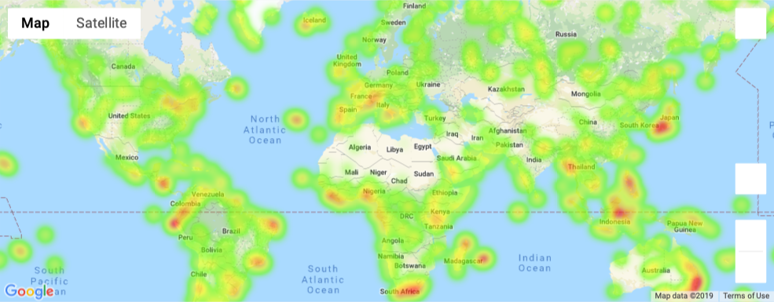

# Latitutde effect on weather conditions - python_api

Project Description

The task was to create a Python script to visualize the weather (max temp, humidity, cloudiness, and wind speed) of 500+ cities across the world of varying distance from the equator and compare the weather using scatter plots using matplotlib. A second part of the task required using the saved city database for the first part of the task and select a vacation city based on prereqisites then plot them on a map.

Tools Required

Python, 
Jupyter Notebook, 
Matplotlib,
OpenMapWeatherAPI,
Citypy,
jupyter-gmaps,
Google Places API

Instructions
Weather.py
- Output the csv file and create a range of latitudes and longitudes for random selection
- Generate city list looping through random lat_log list and use citypy to select the closest city. 
- Perform API calls to perform weather check using series of successive calls, putting weather data in list and print out a call log.
- Exported raw data to csv file and create a dataframe. Clean dataframe for humidity outliers 
- Build scatter plots for latitude vs each weather condition.
- Create linear regression for scatter plots per hemisphere

VacationPy
- Create dataframe from weatherpy csv file.
- Create a humidity Heatmap layer
- Create new dataframe with desired weather conditions
- Create hotel map with Google places API
- Add hotel marks to heatmap

Files

WeatherPy.ipynb – provides all code to for API calls and scatter plots for weather condiitons
api_keys.py - contains keys for apis
images- contains all saved images

data – contains weatherpy csv data use
VacationPy.ipynb– contains code to create humidity heat map and hotel map

Results
Latitude vs Max Temp

Latitude vs Humidity

Latitude vs cloudiness

Latitude vs Wind speed

Humidity Heatmap

Hotel map

Conclusions

The plot is suggesting that there is a strong correlation between latitude and max temperature. The closer cities are to the equators the higher temperature and drops as they approach the poles.

The code is analyzing the relationship between cities latitude and their humidity. The plot is suggesting that there is no correlation between latitude and humidity.

The code is analyzing the relationship between cities latitude and their cloudiness. The plot is suggesting that there is little to no correlation between latitude and cloudiness.

The code is analyzing the relationship between cities latitude and their wind speed. The plot is suggesting that the closer cities are to the north pole the more cities with higher wind speed.

It can be observed that the closer one gets to the equator the maximum temperature is higher. The r-squared value indicates that there is a correlation between latitude and maximum temperature in the Northern Hemisphere.

It can be observed that the closer one gets to the equator the maximum temperature is higher. The r-squared value indicates 
that there is a correlation between latitude and maximum temperature in the Southern Hemisphere. 

t can be observed that the humidity not impacted by latitude. The r-squared value indicates that there appears to be no correlation between latitude and humidity in the Northern Hemisphere.

It can be observed that the closer one gets to the equator the humidity is higher. The r-squared value indicates that there appears to be very little correlation between latitude and humidity in the Southern Hemisphere. This could also be because ther are no cities below -50 latitude.

It can be observed that the closer one gets to the equator you could find more clouds. The r-squared value indicates that there appears to be very little correlation between latitude and cloudiness in the Northen Hemisphere.

It can be observed that the closer one gets to the equator you could find more clouds. The r-squared value indicates that there appears to be very little correlation between latitude and cloudiness in the Southern Hemisphere.

It can be observed that the closer one gets to the equator wind speeds decrease slightly. The r-squared value indicates that there appears to be no correlation between latitude and wind speed in the Northern Hemisphere.

 It can be observed that the closer one gets to the equator you could find higher wind speeds. The r-squared value indicates that it appears to be no correlation between latitude and wind speed in the Southern Hemisphere.

